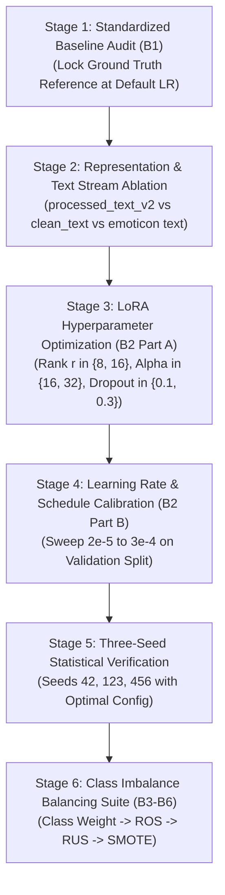

# IndoBERTweet-LoRA Improvement Roadmap (ROI-Prioritized)

**Document Version:** 1.0.0  
**Date:** 2026-09-02  
**Role:** ML Research Engineer  
**Scope:** Staged Engineering Progression (Milestones B0 -> B7)  

---

## 1. Roadmap Architecture & Strategic Ordering

To systematically elevate IndoBERTweet-LoRA from an underfitted initial baseline (51.72% Macro F1) to its full empirical capability (>73% Macro F1) and rigorously benchmark it against LSTM (64.95%), the roadmap is structured into 6 sequential phases prioritized strictly by **Expected Return on Investment (ROI)**:

---

## 2. Detailed Staged Execution Plan

### 🔹 Stage 1 — Standardized Baseline Audit (Milestone B1)
* **Objective:** Establish the unweighted, natural-distribution baseline reference using default thesis parameters ($lr=2\times 10^{-5}, r=16, \alpha=32$).
* **Input:** `Data/processed/banjir_processed_v2.csv` (`processed_text_v2`).
* **Expected Output:** 3-seed artifacts in `Output/indobert_lora/`, `summary.csv`, `indobert_lora_report.md`.
* **Success Criterion:** Complete 3 independent seeds without error, producing empirical baseline numbers for delta calculations.
* **Estimated Kaggle Tesla T4 Runtime:** ~10 minutes (3.3 mins/seed).

---

### 🔹 Stage 2 — Representation & Preprocessing Stream Comparison
* **Objective:** Quantify the exact impact of text cleaning choices on Transformer attention heads by comparing three parallel representations under identical model capacity.
* **Input:**
  1. `clean_text` (lowercased, punctuation-free, stopword-filtered).
  2. `processed_text_v2` (LLM-completed, colloquial normalized, casing/punctuation preserved).
  3. `text_with_emoticon` (emoticon translated to explicit sentiment lexicon).
* **Expected Output:** Comparative evaluation table `reports/representation_ablation.csv`.
* **Success Criterion:** Identify the optimal text stream for downstream LoRA tuning; verify whether emoticon tokens add statistically significant gain ($p < 0.05$).
* **Estimated Kaggle Tesla T4 Runtime:** ~12 minutes (3 runs on validation set).

---

### 🔹 Stage 3 — LoRA Hyperparameter Optimization (Milestone B2 Part A)
* **Objective:** Discover the optimal low-rank parameter budget for Indonesian tweet disaster sentiment.
* **Search Space:**
  * Rank ($r$): `[8, 16]`
  * Alpha ($\alpha$): `[16, 32]` (maintaining $\alpha/r \in \{1.0, 2.0\}$)
  * LoRA Dropout: `[0.1, 0.3]`
  * Target Modules: `['query', 'value']` vs `['query', 'key', 'value', 'dense']`
* **Expected Output:** Grid search matrix `Output/hparam_search_lora/tuning_results.csv`.
* **Success Criterion:** Validation Macro F1 $\ge 0.70$ without exceeding 1.5% trainable parameters.
* **Estimated Kaggle Tesla T4 Runtime:** ~25 minutes (8 trials $\times$ 3 epochs on Val split).

---

### 🔹 Stage 4 — Learning Rate & Schedule Calibration (Milestone B2 Part B)
* **Objective:** Resolve the primary underfitting failure mode by identifying the optimal gradient step velocity for LoRA adapters.
* **Search Space:** $lr \in [2\times 10^{-5}, 5\times 10^{-5}, 1\times 10^{-4}, 2\times 10^{-4}, 3\times 10^{-4}]$ with Linear vs Cosine warmup.
* **Expected Output:** Learning rate response curve `Output/hparam_search_lora/lr_response_curve.png`.
* **Success Criterion:** Validation Macro F1 exceeding 0.72; neutral class recall $> 50\%$.
* **Estimated Kaggle Tesla T4 Runtime:** ~18 minutes (5 trials on Val split).

---

### 🔹 Stage 5 — Three-Seed Reproducibility & Stability Verification
* **Objective:** Execute full 5-epoch training across seeds `42`, `123`, `456` using the optimal parameters established in Stages 3 & 4.
* **Input:** Optimal configuration YAML `configs/indobert_lora_optimal.yaml`.
* **Expected Output:** Complete deliverable suite in `Output/empirical/indobert_baseline_optimal/`.
* **Success Criterion:** Mean Macro F1 $> 0.72$ with standard deviation $\le 0.025$; 100% checklist compliance.
* **Estimated Kaggle Tesla T4 Runtime:** ~10 minutes.

---

### 🔹 Stage 6 — Empirical Balancing Suite (Milestones B3 — B6)
* **Objective:** Benchmark the four thesis balancing strategies on IndoBERTweet-LoRA:
  * **B3 (Class Weighting):** Inverse class frequency weighting in CrossEntropy loss.
  * **B4 (Random Oversampling):** Minority sample replication on training split ($n=10,122$).
  * **B5 (Random Undersampling):** Majority sample reduction on training split ($n=3,261$).
  * **B6 (SMOTE Feature Interpolation):** Feature-space synthetic generation on BERT pooled embeddings.
* **Expected Output:** Respective milestone directories `Output/empirical/indobert_{class_weight, ros, rus, smote}/`.
* **Success Criterion:** Evaluate whether class weighting or sampling remedies minority Neutral ambiguity without damaging overall accuracy.
* **Estimated Kaggle Tesla T4 Runtime:** ~45 minutes total (~11 minutes per balancing technique).

---

## 3. Summary of Investment vs Expected Return

| Stage | Strategic Focus | Primary Risk | Expected ROI | Priority |
| :---: | :--- | :--- | :---: | :---: |
| **Stage 4** | Learning Rate Calibration ($2\times 10^{-4}$) | Instability if LR too high | **Very High (+15 to +20 pp Macro F1)** | **P0 (Immediate)** |
| **Stage 2** | Text Stream / Emoticon Translation | Data formatting pipeline | **High (+2 to +4 pp Macro F1)** | **P1** |
| **Stage 3** | LoRA Rank & Target Modules | GPU memory overflow | **Medium (+1 to +3 pp Macro F1)** | **P2** |
| **Stage 6** | Balancing Suite (Class Weight, ROS) | Majority precision dilution | **High (Neutral Recall +10 pp)** | **P3** |
