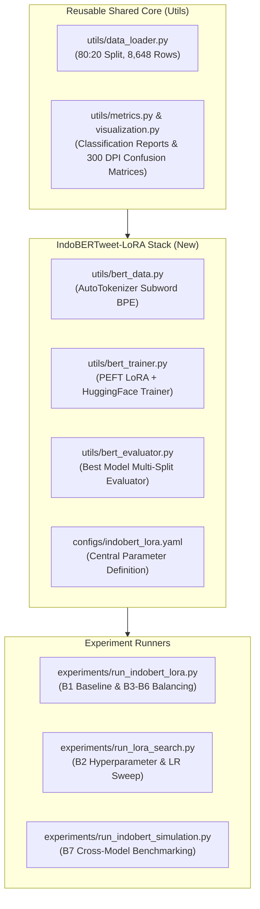

# IndoBERT-LoRA Readiness Audit & Repository Gap Analysis

**Document Version:** 1.0.0  
**Date:** 2026-09-02  
**Role:** ML Research Engineer  
**Scope:** Thesis Baseline & Balancing Suite Transition (LSTM -> IndoBERTweet-LoRA)  

---

## 1. Executive Summary

This audit assesses the readiness of the thesis codebase (`Thesis-LSTM-IndoBERT`) to support the **IndoBERTweet-LoRA** experimental suite (Milestones B1 through B7). The LSTM suite (Milestones M1 through M8) successfully established the empirical baseline and simulated benchmarks using `banjir_processed_v2.csv` (8,648 rows) and a strict zero-leakage 80:20 stratified split protocol.

To guarantee that IndoBERTweet-LoRA is directly and scientifically comparable to the completed LSTM baseline, the IndoBERT pipeline must strictly reuse the existing dataset partitions, evaluation metrics, and reporting contracts while introducing modular HuggingFace/PEFT abstractions optimized for Kaggle Tesla T4 GPU hardware.

---

## 2. Inventory of Reusable Components

The following modules from the LSTM pipeline are model-agnostic, thoroughly verified, and ready for immediate reuse:

| Component | File Path | Status | Reusability Rationale |
| :--- | :--- | :---: | :--- |
| **Data Ingestion & Splitting** | `utils/data_loader.py` | **100% Reusable** | Provides deterministic `load_dataset()`, `split_dataset()`, and `create_validation_split()` with identical stratified splits (Train 72%, Val 8%, Test 20%). |
| **Statistical Metrics** | `utils/metrics.py` | **100% Reusable** | Functions `calculate_metrics()`, `generate_classification_report_df()`, and JSON/CSV exporters handle multiclass sentiment outputs consistently. |
| **Visualization Standards** | `utils/visualization.py` | **100% Reusable** | Standardized 300 DPI seaborn heatmap plotting (`plot_confusion_matrix`) with ordered classes `['Negative', 'Neutral', 'Positive']` and uniform color schemes. |
| **Ground Truth Dataset** | `Data/processed/banjir_processed_v2.csv` | **100% Reusable** | Contains 8,648 clean rows, preprocessed with LLM completion, regex cleaning, and formal colloquial lexicon normalization (`processed_text_v2`). |
| **Kaggle Synchronization** | `kernel-metadata.json`, `kaggle.yml` | **100% Reusable** | Pre-configured for private GPU execution on Kaggle with attached processed datasets. |

---

## 3. Inventory of LSTM-Specific Components

The following components are tightly coupled to recurrent architectures or Keras/PyTorch integer sequence representations and **must not be used** directly in the IndoBERTweet pipeline:

| Component | File Path | Architectural Limitation for IndoBERT |
| :--- | :--- | :--- |
| **Word-Level Tokenizer** | `utils/tokenizer.py` | Employs Keras frequency-based integer token indexing (`fit_tokenizer`, `texts_to_padded_sequences`). Transformers require subword BPE/WordPiece tokenization (`AutoTokenizer`). |
| **RNN Model Architecture** | `utils/model_lstm.py` | Defines `Embedding -> LSTM(128) -> Dropout(0.3) -> Dense(3)`. Replaced by HuggingFace `AutoModelForSequenceClassification` wrapped with PEFT `LoraConfig`. |
| **PyTorch LSTM Trainer** | `utils/trainer.py` | Custom manual training loop with `Adam` and manual early stopping designed for PyTorch tensors. Replaced by HuggingFace `Trainer` or dedicated LoRA loop. |
| **Sequence Data Evaluator** | `utils/evaluator.py` | Expects integer sequence `DataLoader` inputs. Replaced by HuggingFace tokenized dictionary inputs (`input_ids`, `attention_mask`). |
| **LSTM Experiment Runners** | `experiments/run_lstm.py`, `run_m3_baseline.py` | Runner scripts hardcoded to import LSTM models and word tokenizers. |

---

## 4. Gap Analysis: Missing Components for IndoBERT-LoRA

To achieve architectural parity and operational readiness on Kaggle Tesla T4, the following components must be created:

1. **`utils/bert_data.py`**:
   - HuggingFace `Dataset` wrapper accepting tokenized PyTorch tensors (`input_ids`, `attention_mask`, `labels`).
   - Zero-leakage tokenization pipeline using `indolem/indobertweet-base-uncased` with `max_length=128`, `padding="max_length"`, `truncation=True`.
2. **`utils/bert_trainer.py`**:
   - Factory for configuring PEFT `LoraConfig` ($r=16, lpha=32, 	ext{dropout}=0.1$, target `query,value`, classification head preservation).
   - Integration with HuggingFace `Trainer` supporting mixed precision (`fp16=True`), evaluation logging, and early stopping.
3. **`utils/bert_evaluator.py`**:
   - Multi-split inference handler evaluating Train (6,226), Validation (692), and Test (1,730) splits with best checkpoint restoration.
4. **`utils/bert_metrics.py` & `utils/bert_visualization.py`**:
   - Adaptation of metric logging to extract per-epoch training/validation loss and accuracy from Trainer history for dual-curve generation.
5. **`configs/indobert_lora.yaml`**:
   - Centralized, single-source-of-truth configuration file containing all model, LoRA, training, data, split, and runtime parameters.
6. **Task Specifications (`TASKS/B1_baseline.md` - `B7_summary.md`)**:
   - Structured milestones guiding future autonomous experiment execution.

---

## 5. Architectural Alignment & Migration Plan

### Migration Milestones
* **B0 (Current)**: Context Engineering, configuration centralization, failure diagnosis, and lightweight specifications.
* **B1**: 3-seed official IndoBERTweet-LoRA baseline on raw imbalanced distribution.
* **B2**: Hyperparameter search (LoRA rank, alpha, dropout, and learning rate).
* **B3**: Cost-sensitive weighted CrossEntropy loss.
* **B4**: Random Oversampling (ROS).
* **B5**: Random Undersampling (RUS).
* **B6**: SMOTE sequence/feature balancing.
* **B7**: Final empirical synthesis, McNemar significance tests, and thesis reporting.
