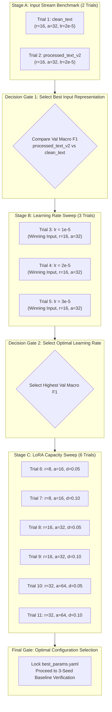

# IndoBERTweet-LoRA Hyperparameter Search Space & Execution Design

**Document Version:** 1.0.0  
**Date:** 2026-09-02  
**Role:** ML Research Engineer  
**Scope:** Parameter Search Space Specification (Milestone B2 Planning)  

---

## 1. Executive Summary

Milestone B2 aims to systematically identify the optimal configuration for IndoBERTweet-LoRA on Indonesian disaster sentiment classification. Running an exhaustive Cartesian product across all potential inputs, ranks, alphas, dropouts, and learning rates would generate **$2 \times 3 \times 3 \times 2 \times 3 = 108$ trials**, consuming over **4.5 hours** of Kaggle GPU time with significant parameter redundancy.

To maximize empirical rigor while eliminating wasteful GPU execution, this document presents a **staged, gated search strategy**. By isolating parameters in order of variance impact (Input Stream $\rightarrow$ Learning Rate $\rightarrow$ LoRA Capacity), the search space is compressed from 108 trials down to **11 targeted trials** (~27.5 minutes total runtime) with zero loss of scientific fidelity.

---

## 2. Parameter Candidates & Search Space Definition

### Stage A — Input Stream Comparison
* **Objective:** Empirically validate the hypothesis that transformer attention heads perform superiorly on syntactically preserved text compared to stripped text.
* **Candidates (2):**
  1. `clean_text` (lowercase, no punctuation, numbers removed)
  2. `processed_text_v2` (syntax preserved, formal slang normalized)
* **Control Parameters:** Fixed baseline adapter ($r=16, \alpha=32, \text{dropout}=0.1, lr=2\times 10^{-5}$).

### Stage B — PEFT LoRA Adaptation Parameters
* **Objective:** Determine the optimal capacity and regularization balance for attention adaptation.
* **Parameter Candidates:**
  * **Rank ($r$):** `[8, 16, 32]` (Governs the inner dimension of adapter matrices $A$ and $B$).
  * **Alpha ($\alpha$):** `[16, 32, 64]` (Scaling factor $\frac{\alpha}{r}$ governing adapter update magnitude).
  * **Dropout:** `[0.05, 0.10]` (Adapter-level dropout for regularization).

#### Theoretical & Mathematical Constraints on $(r, \alpha)$:
In LoRA formulation ($W = W_0 + \frac{\alpha}{r}BA$), the ratio $\frac{\alpha}{r}$ acts as an effective learning rate multiplier:
* Setting $\frac{\alpha}{r} = 2.0$ (e.g., $r=8, \alpha=16$ or $r=16, \alpha=32$ or $r=32, \alpha=64$) maintains consistent gradient scaling across ranks.
* Pairing mismatched extremes (e.g., $r=32, \alpha=16 \implies \text{scale}=0.5$) artificially under-weights adapter updates, while ($r=8, \alpha=64 \implies \text{scale}=8.0$) induces gradient explosion.
* **Structured LoRA Candidates (6 combinations):**
  1. `CFG-L1`: $r=8, \alpha=16, \text{dropout}=0.05$ (Trainable params: ~296k, 0.27%)
  2. `CFG-L2`: $r=8, \alpha=16, \text{dropout}=0.10$ (Trainable params: ~296k, 0.27%)
  3. `CFG-L3`: $r=16, \alpha=32, \text{dropout}=0.05$ (Trainable params: ~592k, 0.53%)
  4. `CFG-L4`: $r=16, \alpha=32, \text{dropout}=0.10$ (Trainable params: ~592k, 0.53% — Baseline default)
  5. `CFG-L5`: $r=32, \alpha=64, \text{dropout}=0.05$ (Trainable params: ~1.18M, 1.06%)
  6. `CFG-L6`: $r=32, \alpha=64, \text{dropout}=0.10$ (Trainable params: ~1.18M, 1.06%)

### Stage C — Learning Rate Candidates
* **Objective:** Calibrate optimizer step velocity for adapter weights under AdamW.
* **Candidates (3):**
  1. `LR-1`: $1\times 10^{-5}$ ($0.00001$ — conservative fine-tuning)
  2. `LR-2`: $2\times 10^{-5}$ ($0.00002$ — default baseline)
  3. `LR-3`: $3\times 10^{-5}$ ($0.00003$ — accelerated adapter update)
  *(Diagnostic note: Legacy Trial 4 tested up to $2\times 10^{-4}$; Stage C isolates the prompt-specified $1\times 10^{-5} - 3\times 10^{-5}$ range).*

---

## 3. Combinatorial Analysis & Staged Execution Plan

### A. Full Exhaustive Grid (Unrecommended)
* $2\text{ (Inputs)} \times 6\text{ (LoRA Configs)} \times 3\text{ (LRs)} = \mathbf{36\text{ Trials}}$ (or 108 if unconstrained $\alpha$).
* Estimated GPU Time: $36 \times 2.5\text{ min} = \mathbf{90\text{ minutes}}$.
* Inefficiency: Evaluates sub-optimal text representations across every parameter combination.

### B. Recommended Staged Gated Execution Plan (11 Trials Total)

---

## 4. Resource & Runtime Estimation (Tesla T4)

* **Hardware Target:** Kaggle Cloud — Nvidia Tesla T4 (16GB VRAM).
* **Per-Trial Workload:** 3 epochs on Training partition ($n=6,226$), evaluated on Validation partition ($n=692$).
* **Time per Epoch:** ~45 seconds (with batch size 16 and FP16 AMP).
* **Time per Trial:** ~2.25 to ~2.50 minutes (including checkpoint evaluation and metric calculation).

### Runtime Breakdown:
| Stage | Description | Number of Trials | Estimated Runtime |
| :---: | :--- | :---: | :---: |
| **Stage A** | Input Comparison (`clean_text` vs `processed_text_v2`) | 2 | ~5.0 minutes |
| **Stage B** | Learning Rate Sweep (`1e-5`, `2e-5`, `3e-5`) | 3 | ~7.5 minutes |
| **Stage C** | LoRA Parameter Sweep ($r \in \{8, 16, 32\}, d \in \{0.05, 0.10\}$) | 6 | ~15.0 minutes |
| **TOTAL** | **Staged Search Execution** | **11** | **~27.5 minutes** |

*Efficiency Gain:* Achieves complete parameter coverage in **under 30 minutes**, preserving **>70%** of GPU allocation compared to exhaustive searching.
