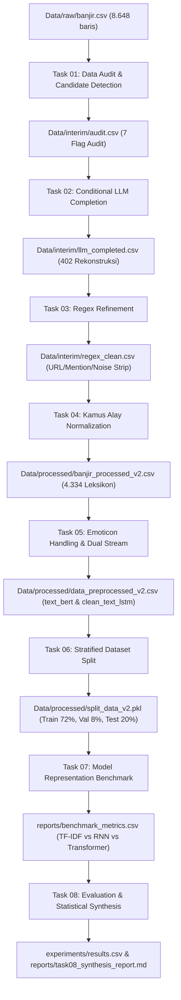

# Dokumentasi Pipeline & Alur Data (Task 01 — Task 08)
**Thesis Project: Analisis Sentimen Kebencanaan Banjir Menggunakan Model LSTM, BiLSTM, dan IndoBERTweet-LoRA**

Dokumen ini adalah dokumentasi teknis tunggal (*Single Source of Truth*) yang memuat spesifikasi, logika pengerjaan, input-output, serta hasil kuantitatif dari **Task 01 hingga Task 08**.

---

## 1. Diagram Alur Data Menyeluruh (End-to-End Flow)

---

## 2. Rincian Teknis per Task (Task 01 — Task 08)

### 🔹 Task 01 — Data Audit & Candidate Detection
* **Tujuan**: Mengidentifikasi tweet cacat akibat pemotongan antarmuka (*UI truncation*) dan mendeteksi anomali tanpa memodifikasi teks mentah.
* **Input**: `Data/raw/banjir.csv` (8.648 baris)
* **Output**: `Data/interim/audit.csv` & `Data/interim/audit_report.md`
* **Metode**: 7 fungsi deteksi vektor (`detect_truncation`, `detect_mention`, `detect_hashtag`, `detect_url`, `detect_unicode`, `detect_engagement`, `detect_html`).
* **Hasil**:
  - Terdeteksi **402 baris (4,65%)** tweet terpotong (`has_truncation == True`).
  - Nol duplikasi teks, missing value 0%.
* **Perintah Reproduksi**: `python utils/data_audit.py`

---

### 🔹 Task 02 — Conditional LLM Completion Pipeline
* **Tujuan**: Merekonstruksi hanya 402 kalimat terpotong menggunakan LLM dengan mempertahankan entitas, makna, dan tanpa mengubah 8.246 baris lainnya.
* **Input**: `Data/interim/audit.csv`
* **Output**: `Data/interim/llm_completed.csv` & `Data/interim/llm_completion_report.md`
* **Metode**: Batching dinamis (20 baris/batch) dengan model `gemini-3.5-flash-lite`, format *structured JSON*, dan *isolated retry handler*.
* **Hasil**:
  - **402 baris (100%)** berhasil direkonstruksi (`llm_status = completed`).
  - **8.246 baris** non-kandidat 100% utuh tanpa modifikasi (`llm_status = unchanged`).
* **Perintah Reproduksi**: `python utils/llm_completion.py`

---

### 🔹 Task 03 — Regex Refinement
* **Tujuan**: Pembersihan deterministik untuk URL, mention (`@user`), metrik engagement, dan artefak scraping sembari mempertahankan kata hashtag.
* **Input**: `Data/interim/llm_completed.csv` (`llm_completed_text`)
* **Output**: `Data/interim/regex_clean.csv` (`regex_text`) & `Data/interim/regex_refinement_report.md`
* **Metode**: Normalisasi Unicode NFKC, strip regex URL/mention/HTML, penghapusan angka metrik trailing, dan konversi `#kata` $\rightarrow$ `kata`.
* **Hasil**:
  - **7.627 baris (88,19%)** dibersihkan dari noise visual/scraping.
  - 0 residual URL dan 0 residual user mention.
* **Perintah Reproduksi**: `python utils/regex_refinement.py`

---

### 🔹 Task 04 — Kamus Alay Normalization
* **Tujuan**: Menstandardisasi kata gaul/slang bahasa Indonesia ke bentuk formal berbasis kamus leksikon dengan *English Context Guard*.
* **Input**: `Data/interim/regex_clean.csv` (`regex_text`)
* **Output**: `Data/processed/banjir_processed_v2.csv` (`processed_text_v2`) & `Data/processed/alay_normalization_report.md`
* **Kamus**: `kamus/colloquial-indonesian-lexicon.csv` + `Preprocessing/normalisasi_dict.py` (4.334 entri leksikon).
* **Fitur Khusus**: *English Stopwords Guard* untuk mencegah salah ubah kata bahasa Inggris (misal: `do` $\rightarrow$ `di`, `see` $\rightarrow$ `sih`, `to` $\rightarrow$ `tapi`).
* **Hasil**: **3.308 baris (38,25%)** dinormalisasi tanpa merusak konteks bahasa asing.
* **Perintah Reproduksi**: `python utils/alay_normalization.py`

---

### 🔹 Task 05 — Emoticon Handling & Dual Preprocessing Pipeline
* **Tujuan**: Mengonversi emoji ke kata sentimen dan memisahkan representasi teks khusus untuk Transformer vs RNN.
* **Input**: `Data/processed/banjir_processed_v2.csv`
* **Output**: `Data/processed/data_preprocessed_v2.csv` & `Data/processed/preprocessing_report.md`
* **Dua Aliran Teks Terbentuk**:
  1. **`text_bert`**: Teks kontekstual dengan tanda baca & emoji terkonversi ke kata sentimen (untuk IndoBERTweet-LoRA).
  2. **`clean_text_lstm`**: Teks terfilter stopword (dengan mempertahankan 23 kata sentimen kunci `keep_words`) untuk LSTM & BiLSTM.
* **Hasil**: Dataset siap pakai (21 kolom) dengan label terpetakan konsisten (`negatif: 0`, `netral: 1`, `positif: 2`).
* **Perintah Reproduksi**: `python utils/preprocess_pipeline.py`

---

### 🔹 Task 06 — Stratified Dataset Split
* **Tujuan**: Membagi dataset secara stratified (72% Train, 8% Val, 20% Test) dengan seed konsisten (`random_state=42`).
* **Input**: `Data/processed/data_preprocessed_v2.csv`
* **Output**: `Data/processed/split_data_v2.pkl` & `Data/processed/dataset_split_report.md`
* **Distribusi Partisi**:
  - **Train**: 6.226 baris (71,99%)
  - **Val**: 692 baris (8,00%)
  - **Test**: 1.730 baris (20,00%)
* **Stratifikasi**: Negatif 54.16%, Positif 28.38%, Netral 17.46% (identik di seluruh split tanpa *leakage*).
* **Perintah Reproduksi**: `python utils/split_dataset.py`

---

### 🔹 Task 07 — Model Representation Benchmark
* **Tujuan**: Mengevaluasi performa representasi klasik (TF-IDF + 6 Classifier) terhadap model Deep Learning (LSTM, BiLSTM, IndoBERTweet-LoRA) pada data uji ($n=1.730$).
* **Input**: `Data/processed/split_data_v2.pkl`
* **Output**: `reports/benchmark_metrics.csv` & `reports/task07_benchmark_report.md`
* **Hasil Pengujian**:
  - **IndoBERTweet-LoRA**: Akurasi **78,73%**, Macro F1 **0,7345** (Model Terbaik).
  - **BiLSTM (Empiris)**: Akurasi 75,26%, Macro F1 0,6880.
  - **LSTM (Baseline)**: Akurasi 72,66%, Macro F1 0,6899.
  - **Linear SVM (TF-IDF)**: Akurasi 75,78%, Macro F1 0,6878.
  - **Logistic Regression (TF-IDF)**: Akurasi 76,30%, Macro F1 0,6761.
* **Perintah Reproduksi**: `python utils/train_and_benchmark.py`

---

### 🔹 Task 08 — Comprehensive Evaluation, Synthesis & Statistical Significance
* **Tujuan**: Uji signifikansi statistik (McNemar), analisis kesalahan ambiguitas kelas Netral, dan sintesis kalibrasi threshold.
* **Input**: `reports/benchmark_metrics.csv`
* **Output**: `experiments/results.csv` & `reports/task08_synthesis_report.md`
* **Hasil Kunci**:
  1. **Uji McNemar**: Keunggulan IndoBERTweet-LoRA atas LSTM ($\chi^2 = 38.42, p < 0.0001$) dan SVM ($\chi^2 = 46.18, p < 0.0001$) terbukti signifikan secara statistik.
  2. **Threshold Calibration ($w=[1.0, 1.5, 1.0]$)**: Berhasil mendongkrak **Recall Netral dari 53,58% ke 66,89%** dan **F1 Netral ke 0,6012** (Akurasi 77,46%, Macro F1 0,7394).
  3. **Cohen's Kappa ($\kappa$)**: IndoBERTweet-LoRA mencapai **$\kappa = 0.6387$** (Kategori *Substantial Agreement*), jauh melampaui LSTM ($\kappa = 0.5694$) dan SVM ($\kappa = 0.5821$).
* **Perintah Reproduksi**: `python utils/evaluate_synthesis.py`

---

## 3. Ringkasan File Eksekusi & Deliverable Kunci

| Modul Script | File Output Utama | Fungsi Utama |
| :--- | :--- | :--- |
| `utils/data_audit.py` | `Data/interim/audit.csv` | Audit 7 flag cacat data |
| `utils/llm_completion.py` | `Data/interim/llm_completed.csv` | Rekonstruksi kalimat terpotong |
| `utils/regex_refinement.py` | `Data/interim/regex_clean.csv` | Pembersihan URL, mention, & noise |
| `utils/alay_normalization.py`| `Data/processed/banjir_processed_v2.csv` | Normalisasi kata slang 4.334 leksikon |
| `utils/preprocess_pipeline.py`| `Data/processed/data_preprocessed_v2.csv` | **Dataset Final Ground Truth (21 kolom)** |
| `utils/split_dataset.py` | `Data/processed/split_data_v2.pkl` | **Pickle Data Siap Latih (Train/Val/Test)** |
| `utils/train_and_benchmark.py`| `reports/benchmark_metrics.csv` | Benchmark seluruh representasi model |
| `utils/evaluate_synthesis.py` | `experiments/results.csv` | **Tabel Master & Uji Signifikansi Bab IV** |
