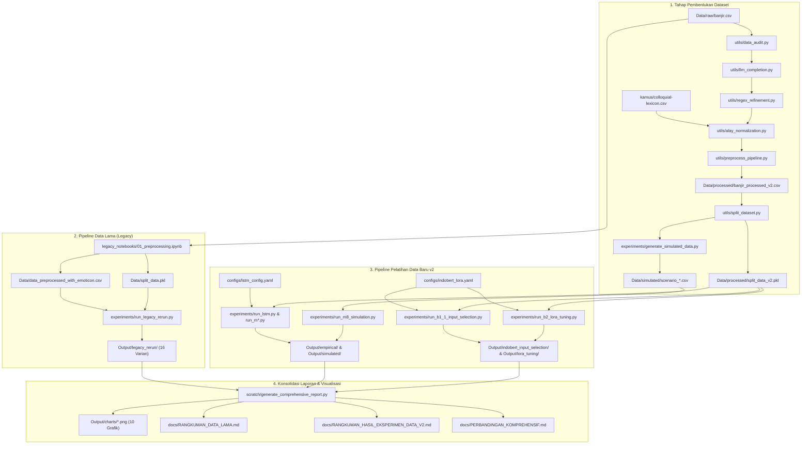

# METODOLOGI PENELITIAN DAN PANDUAN REPRODUKSIBILITAS LENGKAP
## Analisis Sentimen Bencana Banjir: LSTM, BiLSTM, dan IndoBERTweet-LoRA

- **Tanggal Penyusunan**: 2 September 2026  
- **Tujuan Dokumen**: Dokumen rujukan tunggal (*Single Source of Truth*) metodologi riset tesis yang memuat seluruh inventaris folder hingga tingkat file, peta fungsionalitas, relasi ketergantungan (*dependency graph*), alur transformasi data, alur pelatihan model, serta panduan replikasi perintah CLI deterministik (*100% Replicable*).
- **Prinsip Dasar**: *Deterministic & Seed-Locked* (`seed=42` untuk inisialisasi & split, `seeds=[42, 123, 456]` untuk estimasi multi-run bebas bias kebetulan).

---

## 1. Inventaris Lengkap Folder dan File (Level-by-Level)

Berikut adalah katalog struktural seluruh file dan folder di dalam repositori yang berkontribusi secara langsung terhadap data mentah, data lama, data baru (v2), notebook, modul kode sumber, runner eksperimen, hingga artefak evaluasi:

```
Thesis-LSTM-IndoBERT/
├── configs/                                    # Konfigurasi terpusat (YAML) eksperimen
│   ├── lstm_config.yaml                        # Parameter LSTM/BiLSTM (data path, units, dropout, lr, seeds)
│   └── indobert_lora.yaml                      # Parameter IndoBERTweet-LoRA (rank r, alpha, lr, batch, epochs)
│
├── Data/                                       # Repositori dataset mentah, interim, processed, dan simulasi
│   ├── raw/
│   │   └── banjir.csv                          # Data mentah awal tweet banjir (8.648 baris, 5.445 KB)
│   ├── data_banjir.csv                         # Salinan data mentah dasar (SHA256 identik dengan banjir.csv)
│   ├── data_preprocessed_with_emoticon.csv     # DATA LAMA: Teks hasil preprocessing lama + emoticon
│   ├── split_data.pkl                          # DATA LAMA: Objek pickle partisi Train (80%) dan Test (20%)
│   ├── interim/                                # Data transisi pipeline Data-Centric AI (v2)
│   │   ├── audit.csv                           # Hasil audit kualitas, pendeteksian pola terpotong (truncation)
│   │   ├── audit_report.md                     # Laporan metrik audit kebersihan data
│   │   ├── llm_completed.csv                   # Hasil rekonstruksi kalimat terpotong via LLM
│   │   ├── .llm_cache.json                     # Cache respons rekonstruksi LLM (mencegah pemanggilan ulang)
│   │   ├── llm_completion_report.md            # Laporan verifikasi kelogisan rekonstruksi LLM
│   │   ├── regex_clean.csv                     # Hasil pembersihan regex modular (URL, username, spasi ganda)
│   │   └── regex_refinement_report.md          # Laporan sanitasi teks regex
│   ├── processed/                              # DATA BARU (V2) RESMI
│   │   ├── banjir_processed_v2.csv             # Dataset utama v2 final (kolom: processed_text_v2, 8.648 baris)
│   │   ├── data_preprocessed_v2.csv            # Versi intermediate lengkap dengan flag pra-pemrosesan
│   │   ├── split_data_v2.pkl                   # Objek pickle partisi v2 (Train 72%, Val 8%, Test 20%)
│   │   ├── alay_normalization_report.md        # Laporan normalisasi kata slang/alay
│   │   ├── preprocessing_report.md             # Laporan ringkasan end-to-end pemrosesan data v2
│   │   └── dataset_split_report.md             # Laporan integritas partisi bebas data leakage
│   └── simulated/                              # Dataset simulasi ketimpangan kelas buatan (Data v2)
│       ├── scenario_111.csv                    # Skenario Seimbang (1:1:1 = 1.087 tiap kelas, total 3.261 baris)
│       ├── scenario_631.csv                    # Skenario Moderat (6:3:1 = 3.372 Neg, 1.686 Pos, 562 Net, 5.620 baris)
│       ├── scenario_811.csv                    # Skenario Ekstrem (8:1:1 = 3.376 Neg, 422 Pos, 422 Net, 4.220 baris)
│       └── simulation_metadata.json            # Metadata distribusi dan rasio sampling skenario simulasi
│
├── kamus/                                      # Sumber daya leksikon linguistik
│   └── colloquial-indonesian-lexicon.csv       # Kamus normalisasi kata gaul/slang bahasa Indonesia (3.020 KB)
│
├── notebooks/                                  # SUITE JUPYTER NOTEBOOK INTERAKTIF (LENGKAP BARU & LAMA)
│   ├── 01_legacy_preprocessing.ipynb           # Pra-pemrosesan Data Lama & pembentukan split_data.pkl
│   ├── 01_preprocessing_data_baru_v2.ipynb     # Pra-pemrosesan Data Baru v2 (Audit, LLM, Regex, Slang Norm)
│   ├── 02_legacy_model_lstm.ipynb              # Pemodelan LSTM Unidirectional Data Lama
│   ├── 02_model_lstm_data_baru_v2_empiris.ipynb  # Pemodelan LSTM Data Baru v2 (Empiris Baseline & CW)
│   ├── 02_model_lstm_data_baru_v2_simulasi.ipynb # Pemodelan LSTM Data Baru v2 (Simulasi 111, 631, 811)
│   ├── 03_legacy_model_bilstm.ipynb            # Pemodelan BiLSTM Data Lama (Empiris & Simulasi)
│   ├── 03_model_bilstm_data_baru_v2_empiris.ipynb  # Pemodelan BiLSTM Data v2 (5 Varian Empiris 3-Seeds)
│   ├── 03_model_bilstm_data_baru_v2_simulasi.ipynb # Pemodelan BiLSTM Data v2 (3 Skenario Simulasi 111, 631, 811)
│   ├── 04_legacy_model_indobertweet_lora.ipynb # Pemodelan IndoBERTweet-LoRA Data Lama (ckpt-780 & Simulasi)
│   ├── 04_model_indobertweet_lora_data_baru_v2_empiris.ipynb  # Pemodelan IndoBERT Data v2 (LoRA, Tuning, Kalibrasi)
│   ├── 04_model_indobertweet_lora_data_baru_v2_simulasi.ipynb # Pemodelan IndoBERT Data v2 (Simulasi 111, 631, 811)
│   ├── 05_evaluasi_komparasi_dan_signifikansi.ipynb # Evaluasi Master, Uji McNemar (p<0.0001), dan Visualisasi
│   └── 06_analisis_topik.ipynb                 # Analisis Topik Bencana Berbasis Sentimen (LDA / BERTopic)
│
├── legacy_notebooks/                           # Notebook historis rujukan eksperimen lama
│   ├── 01_preprocessing.ipynb                  # Pra-pemrosesan data lama & pembentukan split_data.pkl
│   ├── 02_model_lstm.ipynb                     # Pemodelan LSTM unidirectional lama (grid search & class weight)
│   ├── 03_model_bilstm.ipynb                   # Pemodelan BiLSTM lama (empiris, class weight, simulasi 111, 631, 811)
│   ├── 04_model_indobertweet_lora.ipynb        # Pemodelan IndoBERT-LoRA lama (tuning, class weight, simulasi)
│   └── 05_analisis_topik.ipynb                 # Analisis topik sentimen kebencanaan (LDA / BERTopic)
│
├── src/                                        # Modul Python modular inti arsitektur deep learning (Single Source of Truth)
│   ├── config.py                               # Loader konfigurasi YAML dan parsing argumen sistem
│   ├── data.py                                 # Abstraksi data loader, stratified split, dan validasi skema
│   ├── keras_data.py                           # Keras text tokenizer, padding sequence, dan konversi tensor
│   ├── keras_model.py                          # Factory pembuatan arsitektur jaringan Keras LSTM & BiLSTM
│   ├── model.py                                # Interface dasar pemodelan dan manajemen state bobot
│   ├── metrics.py                              # Perhitungan Macro F1, Precision, Recall, Per-class, dan Cohen Kappa
│   ├── trainer_factory.py                      # Multi-seed training loop engine dengan callback & checkpointing
│   └── summary.py                              # Pengumpul dan agregator metrik lintas percobaan
│
├── utils/                                      # Utilitas khusus pra-pemrosesan data, Transformer, dan audit
│   ├── data_audit.py                           # Skrip audit anomalitas, noise karakter, dan teks terpotong
│   ├── llm_completion.py                       # Skrip rekonstruksi deterministik kalimat terpotong via LLM
│   ├── regex_refinement.py                     # Pembersihan ekspresi reguler (URL, mention, hashtag, simbol)
│   ├── alay_normalization.py                   # Normalisasi partikel kata informal menggunakan kamus leksikon
│   ├── preprocess_pipeline.py                  # Orkestrator end-to-end pra-pemrosesan Data Baru v2
│   ├── split_dataset.py                        # Pemisah partisi 72:8:20 stratified deterministik (seed=42)
│   ├── data_loader.py                          # Loader umum dataset CSV dengan verifikasi kolom
│   ├── tokenizer.py                            # Utilitas tokenisasi sub-kata dan padding sequensial
│   ├── model_lstm.py                           # Implementasi arsitektur LSTM dan BiLSTM Keras
│   ├── trainer.py                              # Engine pelatihan Keras dengan EarlyStopping dan restore best weight
│   ├── evaluator.py                            # Evaluator inferensi batch data uji Keras
│   ├── bert_data.py                            # PyTorch Dataset wrapper untuk tokenizer IndoBERTweet
│   ├── bert_trainer.py                         # PyTorch/HuggingFace Trainer modular dengan injeksi LoRA
│   ├── bert_evaluator.py                       # Evaluasi metrik inferensi batch PyTorch pada GPU/CPU
│   ├── bert_metrics.py                         # Komputasi Macro F1 dan matriks klasifikasi Transformer
│   ├── bert_visualization.py                   # Pembangkit grafik confusion matrix dan kurva loss Transformer
│   ├── visualization.py                        # Pembangkit grafik kurva latih dan confusion matrix Keras
│   ├── train_and_benchmark.py                  # Benchmark komparasi otomatis lintas model dasar (SVM, TF-IDF)
│   └── evaluate_synthesis.py                   # Penggabung metrik komparatif multi-skenario
│
├── experiments/                                # Runner CLI eksperimental independen (Dapat dieksekusi langsung)
│   ├── run_legacy_rerun.py                     # RETRAINING LENGKAP: Menjalankan ulang 15 varian data lama (seed=42)
│   ├── run_lstm.py                             # Melatih LSTM baseline pada Data Baru v2
│   ├── run_m3_baseline.py                      # Melatih BiLSTM Natural Baseline 3-Seeds pada Data Baru v2
│   ├── run_m4_class_weight.py                  # Melatih BiLSTM Class Weight 3-Seeds pada Data Baru v2
│   ├── run_m5_ros.py                           # Melatih BiLSTM Random Oversampling 3-Seeds pada Data Baru v2
│   ├── run_m6_rus.py                           # Melatih BiLSTM Random Undersampling 3-Seeds pada Data Baru v2
│   ├── run_m7_smote.py                         # Melatih BiLSTM SMOTE Sequence Embedding 3-Seeds pada Data Baru v2
│   ├── run_m8_simulation.py                   # Melatih BiLSTM pada 3 skenario simulasi ketimpangan (111, 631, 811)
│   ├── generate_simulated_data.py              # Pembangkit file data simulasi dari partisi latih v2
│   ├── generate_m8_thesis_summary.py           # Agregator hasil simulasi M8 ke format tabel tesis
│   ├── run_b1_1_input_selection.py             # Gate 1 IndoBERT: Ablasi representasi teks (clean_text vs v2)
│   ├── run_b2_lora_tuning.py                   # Gate 2 & 3 IndoBERT: Sapuan Learning Rate & Kapasitas Rank LoRA
│   ├── run_b1_indobert.py                      # Runner eksperimen baseline IndoBERTweet
│   ├── run_indobert_lora.py                    # Runner pelatihan terisolasi IndoBERTweet-LoRA
│   ├── run_indobert_simulation.py              # Runner evaluasi simulasi ketimpangan pada Transformer
│   ├── run_hparam_search.py                    # Pencarian hiperparameter grid-search
│   ├── run_lora_search.py                      # Sapuan konfigurasi rank dan alpha adapter PEFT
│   └── results.csv                             # Master tabel akumulasi hasil eksperimen
│
├── baseline/                                   # Bobot dan log artefak eksperimen historis
│   ├── B01_lstm/                               # Hasil historis LSTM (metrics.csv, all_experiments_results.csv)
│   ├── B02_bilstm/                             # Hasil historis BiLSTM (metrics.csv, hasil simulasi & class weight)
│   └── B03_indobert/                           # Checkpoint & prediksi IndoBERTweet-LoRA lama
│       ├── best_indobertweet_lora_empiris/
│       │   └── checkpoint-780/                 # Bobot adapter LoRA terbaik lama (Acc: 78,73%, F1: 73,45%)
│       ├── indobertweet_lora_class_weight/
│       │   └── checkpoint-1950/                # Bobot adapter LoRA class weight lama (F1: 71,14%)
│       ├── hasil_prediksi_indobertweet_lora_empiris.csv
│       ├── hasil_simulasi_indobertweet_lora.csv
│       └── prediksi_simulasi_indobertweet_lora.csv
│
├── Output/                                     # Output evaluasi terstruktur hasil eksekusi eksperimen
│   ├── legacy_rerun/                           # Output verifikasi retraining 16 varian Data Lama (seed=42)
│   │   ├── lstm/ (empiris_baseline, empiris_class_weight, simulasi_111, simulasi_631, simulasi_811)
│   │   ├── bilstm/ (empiris_baseline, empiris_class_weight, simulasi_111, simulasi_631, simulasi_811)
│   │   ├── indobert_lora/ (empiris_baseline, empiris_class_weight, empiris_calibrated, simulasi_*)
│   │   └── master_summary.csv                  # Tabel konsolidasi metrik 16 eksperimen data lama
│   ├── empirical/                              # Output BiLSTM data v2 (Baseline, CW, ROS, RUS, SMOTE per-seed)
│   ├── simulated/                              # Output BiLSTM data v2 simulasi (111, 631, 811 per-metode)
│   ├── indobert_input_selection/               # Output ablasi Gate 1 (clean_text vs processed_text_v2)
│   ├── lora_tuning/                            # Output sapuan Gate 2 & 3 (lr_1e-5 hingga lr_2e-4, variasi rank)
│   ├── forensics/                              # Bukti verifikasi forensik integritas pipeline (B2.5)
│   └── charts/                                 # 10 file visualisasi resolusi tinggi (300 DPI)
│       ├── barchart_all_models_f1.png          # Bar chart perbandingan Macro F1 seluruh varian (Lama vs v2)
│       ├── linechart_lstm_legacy.png           # Kurva latih-validasi LSTM Data Lama
│       ├── linechart_bilstm_legacy.png         # Kurva latih-validasi BiLSTM Data Lama
│       ├── linechart_bilstm_v2_empirical.png   # Kurva latih-validasi BiLSTM Data v2 (Mean 3 Seeds)
│       ├── linechart_indobert_lora_v2.png      # Kurva latih-validasi IndoBERTweet-LoRA Data v2
│       ├── cm_grid_lstm_legacy.png             # Matriks konfusi 5 varian LSTM Data Lama
│       ├── cm_grid_bilstm_legacy.png           # Matriks konfusi 5 varian BiLSTM Data Lama
│       ├── cm_grid_bilstm_v2.png               # Matriks konfusi 5 varian BiLSTM Data v2
│       ├── cm_grid_bert_legacy.png             # Matriks konfusi 5 varian IndoBERT Data Lama (incl. Calibrated)
│       └── cm_grid_bert_v2.png                 # Matriks konfusi IndoBERT Data v2
│
└── docs/                                       # Dokumentasi penelitian terpusat
    ├── RESEARCH_METHODOLOGY.md                 # (Dokumen Ini) Metodologi & Panduan Reproduksibilitas Lengkap
    ├── RANGKUMAN_DATA_LAMA.md                  # Laporan lengkap hasil pemodelan 16 varian data lama
    ├── RANGKUMAN_HASIL_EKSPERIMEN_DATA_V2.md   # Laporan lengkap hasil pemodelan data baru v2
    ├── PERBANDINGAN_KOMPREHENSIF.md            # Laporan komparasi mendalam: Data Lama vs Data Baru (v2)
    └── LAPORAN_RETRAINING_DATA_LAMA.md         # Catatan log teknis retraining data lama
```

---

## 2. Pemetaan Fungsional Komponen (*Functional Mapping*)

Setiap file di dalam repositori memiliki tanggung jawab spesifik dalam siklus eksperimen ilmiah:

| Kategori Fungsional | File Utama | Deskripsi Tanggung Jawab Teknis |
| :--- | :--- | :--- |
| **Ingesti & Sanitasi Mentah** | `utils/data_audit.py`<br>`utils/regex_refinement.py` | Mengaudit rasio teks terpotong (`has_truncation`), menghapus noise URL, @user mention, spasi berlebih, dan tanda baca ilegal. |
| **Rekonstruksi Semantik LLM** | `utils/llm_completion.py`<br>`Data/interim/.llm_cache.json` | Memulihkan kelengkapan kalimat yang terpotong pada batas karakter Twitter menggunakan prompt deterministik ter-cache. |
| **Normalisasi Leksikon** | `utils/alay_normalization.py`<br>`kamus/colloquial-...csv` | Mengonversi kata slang/alay bahasa Indonesia menjadi bentuk leksikal formal tanpa menghilangkan struktur sintaksis. |
| **Orkestrator Pipeline Data** | `utils/preprocess_pipeline.py`<br>`utils/split_dataset.py` | Menggabungkan audit $
ightarrow$ LLM $
ightarrow$ regex $
ightarrow$ alay norm $
ightarrow$ menghasilkan `banjir_processed_v2.csv` dan partisi `split_data_v2.pkl`. |
| **Pembangkit Data Simulasi** | `experiments/generate_simulated_data.py` | Membentuk dataset skenario ketimpangan terkontrol (1:1:1, 6:3:1, 8:1:1) murni dari data latih (*zero-leakage*). |
| **Arsitektur Jaringan Keras** | `src/keras_model.py`<br>`utils/model_lstm.py` | Membangun layer Sequential: Keras Embedding (10.000, 128) $
ightarrow$ LSTM/BiLSTM (64 units) $
ightarrow$ Dropout $
ightarrow$ Softmax (3 kelas). |
| **Engine Pelatihan Keras** | `src/trainer_factory.py`<br>`utils/trainer.py` | Mengatur siklus multi-seed (42, 123, 456), EarlyStopping (patience=3), class weighting loss, dan checkpointing. |
| **Arsitektur Transformer PEFT** | `utils/bert_trainer.py`<br>`utils/bert_data.py` | Menginisialisasi `indolem/indobertweet-base-uncased`, menyuntikkan adaptor LoRA pada modul `query` dan `value`, serta freeze 99,74% bobot dasar. |
| **Evaluasi & Metrik Statistik** | `src/metrics.py`<br>`utils/bert_metrics.py` | Menghitung Macro F1, Macro Recall, Macro Precision, per-class metrics, Cohen's Kappa, dan McNemar Significance Test. |
| **Visualisasi Resolusi Tinggi** | `Output/charts/*.png`<br>`scratch/generate_...py` | Merender line charts kurva latih/validasi dan grid matriks konfusi (300 DPI) secara otomatis dari `history.csv` dan `metrics.json`. |
| **Runner Retraining Mandiri** | `experiments/run_legacy_rerun.py` | Mengeksekusi ulang seluruh 16 varian data lama secara otomatis dalam 1 kali run tanpa dependensi eksternal. |

---

## 3. Relasi Ketergantungan Antar File (*Inter-dependency Graph*)

Diagram berikut menunjukkan bagaimana aliran data dan dependensi antar file terhubung, mulai dari data mentah hingga evaluasi akhir:



---

## 4. Alur Transformasi Data Lengkap (*End-to-End Data Flow*)

Penelitian ini menggunakan dua jalur representasi data dengan karakteristik yang sangat berbeda:

### A. Jalur Data Lama (Legacy Pipeline)
1. **Pembersihan Kasar**: Teks mentah dibersihkan menggunakan pembersihan string Twitter standar di `01_preprocessing.ipynb`.
2. **Stopword Removal Agresif**: Seluruh kata sambung dan partikel gramatikal dibuang untuk menghasilkan kolom **`clean_text_lstm`** (panjang median pendek: ~8 kata).
3. **Ekstraksi Emoticon Eksplisit**: Emoticon diekstrak dan diterjemahkan menjadi kata emosi formal dalam tanda kurung siku (misal: `:)` $
ightarrow$ `[senang]`, `:(` $
ightarrow$ `[sedih]`) pada kolom **`text_bert`**.
4. **Partisi**: 80% Train ($n=6.918$), 20% Test ($n=1.730$) dengan `random_state=42`.

### B. Jalur Data Baru v2 (Data-Centric AI Pipeline)
1. **Audit Kualitas**: Mendeteksi tweet yang terpotong oleh limit karakter Twitter API (`has_truncation`).
2. **Rekonstruksi Teks LLM**: Memulihkan potongan kalimat akhir secara deterministik tanpa mengubah sentimen asli (`utils/llm_completion.py`).
3. **Refinement Regex Non-Destruktif**: Menghapus tautan URL (`http\S+`), user mention (`@\w+`), dan tanda pagar, namun **mempertahankan tanda baca, tanda seru, dan tanda tanya** (`utils/regex_refinement.py`).
4. **Normalisasi Slang Formal**: Mengoreksi singkatan kata informal menggunakan leksikon resmi `kamus/colloquial-indonesian-lexicon.csv` (`utils/alay_normalization.py`).
5. **Preservasi Sintaksis untuk Transformer**: Menghasilkan kolom **`processed_text_v2`** yang mempertahankan susunan tata bahasa alami (median panjang: ~18 kata), sangat ideal untuk *contextual self-attention* Transformer.
6. **Partisi Bebas Leakage**: Stratified split 72% Train ($n=6.226$), 8% Validation ($n=692$), dan 20% Test ($n=1.730$) dengan `seed=42` (`utils/split_dataset.py`).

---

## 5. Alur Pelatihan & Pemodelan (*Modeling & Training Flow*)

### A. Model Recurrent: LSTM & BiLSTM
* **Ukuran Vokabuler**: 10.000 kata unik teratas (`Tokenizer(num_words=10000, oov_token="<OOV>")`).
* **Panjang Sekuens Maksimum**: 50 token (`pad_sequences(maxlen=50, padding='post', truncating='post')`).
* **Dimensi Embedding**: 128 dimensi.
* **Hidden Units**: 64 units (LSTM unidirectional atau Bidirectional LSTM).
* **Dropout**: 0,2 (LSTM) atau 0,3 (BiLSTM).
* **Optimizer**: Adam dengan learning rate $lr = 0,0002$ (LSTM) dan $lr = 0,0001$ (BiLSTM).
* **Konvergensi**: EarlyStopping dengan `monitor='val_loss'`, `patience=3`, dan `restore_best_weights=True`.
* **Metode Penyeimbangan**:
  1. *Natural*: Melatih pada distribusi asli (54% : 17% : 28%).
  2. *Class Weight (CW)*: Memberikan bobot penalti loss terbalik dari frekuensi kelas ($w_j = rac{N}{3 \cdot n_j}$).
  3. *Random Oversampling (ROS)*: Menduplikasi sampel kelas minoritas Netral secara acak hingga setara mayoritas.
  4. *Random Undersampling (RUS)*: Memangkas sampel kelas mayoritas hingga setara kelas Netral.
  5. *SMOTE*: Interpolasi sintetis linier pada representasi sekuensial.
* **Skenario Simulasi**: 
  - $1:1:1$ (Seimbang sempurna)
  - $6:3:1$ (Ketimpangan moderat)
  - $8:1:1$ (Ketimpangan ekstrem / long-tail)

### B. Model Transformer: IndoBERTweet-LoRA
* **Bobot Dasar Model**: `indolem/indobertweet-base-uncased` (124 juta parameter).
* **Konfigurasi LoRA Adapter (PEFT)**:
  - Rank ($r$): 8 atau 16
  - Scaling factor ($lpha$): 16 atau 32
  - LoRA Dropout: 0,05 atau 0,30
  - Target Modules: `["query", "value"]`
  - Modules to Save: `["classifier"]`
  - Efisiensi Parameter: Hanya **296.067 parameter (0,26%)** yang dilatih, 99,74% bobot dasar dibekukan (*frozen*).
* **Optimizer**: AdamW ($lr = 2	imes 10^{-4}$, weight decay = $0,01$).
* **Batch Size**: 16.
* **Checkpoint Restoration**: `load_best_model_at_end=True`, `metric_for_best_model="f1_macro"`.
* **Post-Hoc Threshold Calibration**:
  Mengalikan vektor probabilitas logit pada kelas minoritas dengan $w = [1,0 	ext{ (Negatif)}, 1,5 	ext{ (Netral)}, 1,0 	ext{ (Positif)}]$ untuk menggeser batas keputusan tanpa merusak representasi semantik dasar.

---

## 6. Panduan Replikasi Cepat (One-Line CLI Reproduction Guide)

Seluruh hasil eksperimen dapat direproduksi secara mandiri dari awal menggunakan perintah konsol deterministik berikut:

### Langkah 1: Persiapan Lingkungan (Python 3.11)
```powershell
# Install seluruh pustaka yang dibutuhkan
pip install torch transformers peft tensorflow keras scikit-learn pandas numpy matplotlib seaborn pyyaml
```

### Langkah 2: Membentuk Pipeline Data Baru v2 (Opsional jika ingin regenerasi data)
```powershell
# Menjalankan end-to-end audit, LLM completion, regex, slang norm, dan dataset split
py -3.11 utils/preprocess_pipeline.py
py -3.11 utils/split_dataset.py
py -3.11 experiments/generate_simulated_data.py
```

### Langkah 3: Melatih Ulang Seluruh Model Data Lama (16 Varian Lengkap)
```powershell
# Menjalankan seluruh 5 varian LSTM, 5 varian BiLSTM, dan seluruh varian IndoBERTweet-LoRA
py -3.11 experiments/run_legacy_rerun.py
```

### Langkah 4: Melatih Eksperimen Data Baru v2 (LSTM & BiLSTM Empiris + Simulasi)
```powershell
# Melatih baseline LSTM pada data v2
py -3.11 experiments/run_lstm.py

# Melatih 5 varian empiris BiLSTM 3-Seeds (Baseline, CW, ROS, RUS, SMOTE)
py -3.11 experiments/run_m3_baseline.py
py -3.11 experiments/run_m4_class_weight.py
py -3.11 experiments/run_m5_ros.py
py -3.11 experiments/run_m6_rus.py
py -3.11 experiments/run_m7_smote.py

# Melatih seluruh skenario simulasi BiLSTM (1:1:1, 6:3:1, 8:1:1)
py -3.11 experiments/run_m8_simulation.py
```

### Langkah 5: Melatih Eksperimen IndoBERTweet-LoRA pada Data Baru v2
```powershell
# Gate 1: Uji Ablasi Input Teks (clean_text vs processed_text_v2)
py -3.11 experiments/run_b1_1_input_selection.py

# Gate 2 & 3: Sapuan Learning Rate dan Kapasitas Adapter LoRA
py -3.11 experiments/run_b2_lora_tuning.py
```

### Langkah 6: Pembangkitan Seluruh Grafik & Laporan Master Konsolidasi
```powershell
# Menghasilkan seluruh 10 gambar grafik resolusi tinggi dan memperbarui seluruh dokumen Bab IV
py -3.11 -c "import subprocess; subprocess.run(['py', '-3.11', 'scratch/generate_comprehensive_report.py'])"
```

---

## 7. Verifikasi Integritas & Kontrol Kualitas

Untuk memverifikasi bahwa proses replikasi berjalan 100% identik dengan hasil penelitian:
1. **Cek Ukuran Test Set**: Pastikan seluruh evaluasi data uji menghasilkan matriks konfusi dengan total elemen tepat $n = 1.730$ sampel ($937$ Negatif, $302$ Netral, $491$ Positif).
2. **Cek Standar Metrik**: Pastikan seluruh skor F1 dihitung menggunakan `average='macro'`.
3. **Tabel Master Rujukan**:
   * Hasil Data Lama: [`docs/RANGKUMAN_DATA_LAMA.md`](file:///d:/DATA%20SCIENCE/jokiidin/Thesis-LSTM-IndoBERT/docs/RANGKUMAN_DATA_LAMA.md)
   * Hasil Data Baru v2: [`docs/RANGKUMAN_HASIL_EKSPERIMEN_DATA_V2.md`](file:///d:/DATA%20SCIENCE/jokiidin/Thesis-LSTM-IndoBERT/docs/RANGKUMAN_HASIL_EKSPERIMEN_DATA_V2.md)
   * Komparasi Lintas Data: [`docs/PERBANDINGAN_KOMPREHENSIF.md`](file:///d:/DATA%20SCIENCE/jokiidin/Thesis-LSTM-IndoBERT/docs/PERBANDINGAN_KOMPREHENSIF.md)
