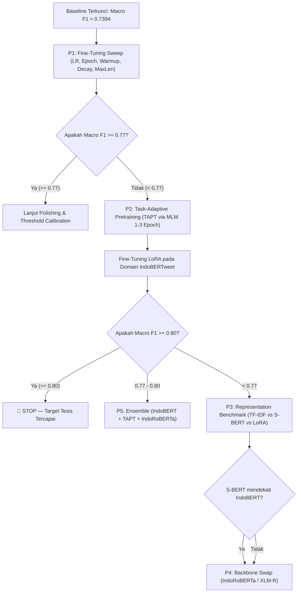

# TASK BOARD — Decision Tree Berbasis ROI (Pareto Workflow)
**Roadmap Eksperimen Terarah Menuju Target Macro F1 $\ge 0.80$**

Dokumen ini menjadi panduan operasional pengambilan keputusan (*Decision Guide*) berbasis rasio *Return on Investment* (ROI) tertinggi. Eksperimen difokuskan pada peningkatan **kapasitas representasi model** dan **adaptasi domain**, bukan mengulang teknik yang terbukti tidak efektif (*resampling*, *label smoothing*, *focal loss*, atau penyesuaian bobot *class weight*).

---

## 1. Decision Guide (Pareto Workflow)

---

## 2. Decision Matrix (Kapan Berhenti & Kapan Lanjut?)

| Capaian Macro F1 | Status Evaluasi | Langkah Tindakan Selanjutnya |
|:---:|:---:|---|
| **$\ge \mathbf{0.80}$** | 🎯 **Target Tercapai** | **STOP**. Kunci seluruh artefak model dan fokus penulisan Bab IV tesis. |
| **$0.77 - 0.80$** | 🟡 **Zona Optimal** | Terapkan **P5 (Ensemble)** atau gabungkan dengan *Threshold Calibration*. |
| **$0.75 - 0.77$** | 🟠 **Sub-Optimal** | Eksekusi **P2 (TAPT)** untuk mengadaptasi representasi bahasa tweet banjir. |
| **$< 0.75$** | 🔴 **Bottleneck Representasi** | Eksekusi **P3 (Representation Benchmark)** & **P4 (Backbone Swap)**. |

---

## 3. Rincian Rencana Eksperimen (Urutan Prioritas)

### 📌 P1 — Fine-Tuning Sweep (Alokasi: 1 Hari)
- **Goal**: Memastikan model IndoBERTweet tidak tertahan oleh konfigurasi pelatihan dasar (*learning rate*, *warmup*, *epoch*, *weight decay*, dan *max length*).
- **Files**:
  - Konfigurasi: [`configs/exp_p1_ft_sweep.yaml`](file:///D:/DATA%20SCIENCE/jokiidin/Thesis-LSTM-IndoBERT/configs/exp_p1_ft_sweep.yaml)
  - Generator: [`tools/generate_notebook.py`](file:///D:/DATA%20SCIENCE/jokiidin/Thesis-LSTM-IndoBERT/tools/generate_notebook.py)
  - Staging Kaggle: `temp_kernel/exp_p1_ft_sweep/`
- **Parameter Grid**:
  - *Learning Rate*: $5\times 10^{-5}, 1\times 10^{-4}, 2\times 10^{-4}, 3\times 10^{-4}$
  - *Epochs*: 5, 8, 10
  - *Warmup Ratio*: 0%, 10% (0.1)
  - *Weight Decay*: 0.0, 0.01
  - *Max Length*: 64, 128
- **Risk**: Komputasi grid search memakan waktu GPU di Kaggle (~1-2 jam).
- **Decision Gate**:
  - Jika $\text{Macro F1} \ge 0.77 \rightarrow$ Lanjut ke *Polishing / Ensemble*.
  - Jika $\text{Macro F1} < 0.77 \rightarrow$ Lanjut ke **P2 (TAPT)**.

---

### 📌 P2 — Task-Adaptive Pretraining / TAPT (Alokasi: 2 Hari)
- **Goal**: Melanjutkan pretraining model IndoBERTweet dengan metode *Masked Language Modeling* (MLM) menggunakan seluruh korpus tweet banjir (~8.648+ tweet) sebelum tahap fine-tuning klasifikasi.
- **Rasionalisasi**: TAPT mengubah representasi embedding model agar mengenali jargon lokal bencana banjir di Sumatera (nama sungai, istilah debit air, singkatan daerah) sehingga representasi semantik kalimat menjadi lebih tajam.
- **Files**:
  - Script Pretraining: `src/pretrain_mlm.py`
  - Dataset Korpus: Teks tweet banjir tanpa label
  - Notebook Runner: `notebooks/exp_p2_tapt_mlm.ipynb`
- **Alur Kerja**:
  $$\text{Korpus Tweet Banjir} \xrightarrow{\text{MLM (1–3 Epoch)}} \text{Domain-Adapted IndoBERTweet} \xrightarrow{\text{Fine-Tuning LoRA}} \text{Classifier Final}$$
- **Risk**: Risiko *catastrophic forgetting* jika pretraining MLM dijalankan terlalu banyak epoch ($>3$).
- **Success Metric**: Macro F1 melonjak ke kisaran **$\ge 0.77 - 0.80$**.

---

### 📌 P3 — Representation Benchmark (Alokasi: 1–2 Hari)
- **Goal**: Membandingkan berbagai jenis representasi fitur secara empiris untuk membuktikan secara ilmiah di mana letak bottleneck performa (apakah pada representasi fitur kalimat atau pada classifier).
- **Files**:
  - Script Benchmark: `src/representation_benchmark.py`
  - Laporan Evaluasi: `reports/representation_benchmark.md`
- **Kombinasi Pengujian**:
  1. **TF-IDF** + Linear SVM
  2. **TF-IDF** + XGBoost
  3. **Sentence-BERT** (`paraphrase-multilingual-MiniLM-L12-v2`) + MLP Classifier
  4. **IndoBERTweet-LoRA** + Linear Head
- **Decision Gate**:
  - Jika Sentence-BERT mendekati performa IndoBERT $\rightarrow$ Bottleneck ada pada representasi global.
  - Jika IndoBERT tetap jauh lebih unggul $\rightarrow$ Lanjut ke **P4 (Backbone Swap)**.

---

### 📌 P4 — Backbone Swap (Alokasi: 1 Hari)
- **Goal**: Menguji model Transformer alternatif dengan arsitektur dan korpus dasar yang berbeda untuk membandingkan kapasitas representasi bahasa Indonesia.
- **Files**:
  - Konfigurasi: `configs/exp_p4_backbone_swap.yaml`
- **Model Pembanding**:
  1. **IndoBERTweet** (Baseline Twitter-specific)
  2. **IndoRoBERTa** (`indobenchmark/indoroberta-base-indonesian-522M`)
  3. **XLM-RoBERTa** (`xlm-roberta-base`)
- **Success Metric**: Menemukan backbone dasar terbaik yang memberikan baseline tertinggi sebelum adaptasi domain.

---

### 📌 P5 — Ensemble Model (Opsional, Alokasi: 1 Hari)
- **Goal**: Menggabungkan probabilitas prediksi dari model terbaik (misal: IndoBERTweet-LoRA + TAPT-LoRA + IndoRoBERTa) menggunakan metode *Soft-Voting / Weighted Averaging*.
- **Syarat Eksekusi**: Hanya dijalankan jika performa model tunggal terbaik berada di rentang **$0.77 - 0.79$** untuk mendorong skor melampaui $\mathbf{\ge 0.80}$.

---

## 4. Checklist Eksekusi 7 Hari

| Hari | Target Deliverable | Status |
|:---:|---|:---:|
| **Hari 1** | Eksekusi **P1 Fine-Tuning Sweep** (Grid LR, Epoch, Warmup, Decay) | 🟡 Siap Dijalankan |
| **Hari 2–3** | Eksekusi **P2 Task-Adaptive Pretraining (TAPT)** via MLM 1–3 Epoch | ⚪ Antrean |
| **Hari 4** | **Fine-Tuning LoRA** pada model hasil TAPT + Evaluasi Test Set | ⚪ Antrean |
| **Hari 5** | Eksekusi **P3 Representation Benchmark** (TF-IDF vs S-BERT vs IndoBERT) | ⚪ Antrean |
| **Hari 6** | Eksekusi **P4 Backbone Swap** (IndoRoBERTa vs XLM-R) jika diperlukan | ⚪ Antrean |
| **Hari 7** | Eksekusi **P5 Ensemble** & Finalisasi Dokumentasi Bab IV | ⚪ Antrean |

---

## 5. Tugas Pemeliharaan & Integrasi Sistem yang Sedang Berjalan

- [x] **Pembersihan Direktori Legacy**: Menghapus folder `temp_kernel_*` lama dan memusatkan staging ke [`temp_kernel/`](file:///D:/DATA%20SCIENCE/jokiidin/Thesis-LSTM-IndoBERT/temp_kernel).
- [🟡] **Pelatihan Baseline RNN Pembanding**: Kernel [`thesis-lstm-v2`](https://www.kaggle.com/emanuelembuaijdak/thesis-lstm-v2) dan [`thesis-bilstm-v2`](https://www.kaggle.com/code/emanuelembuaijdak/thesis-bilstm-v2) sedang berjalan di Kaggle untuk melengkapi tabel Bab IV bebas collapse.
- [x] **Pembaruan Laporan Komprehensif**: Dokumen [`docs/LAPORAN_AKHIR_EKSPERIMEN.md`](file:///D:/DATA%20SCIENCE/jokiidin/Thesis-LSTM-IndoBERT/docs/LAPORAN_AKHIR_EKSPERIMEN.md) telah disinkronkan tanpa buzzword.
